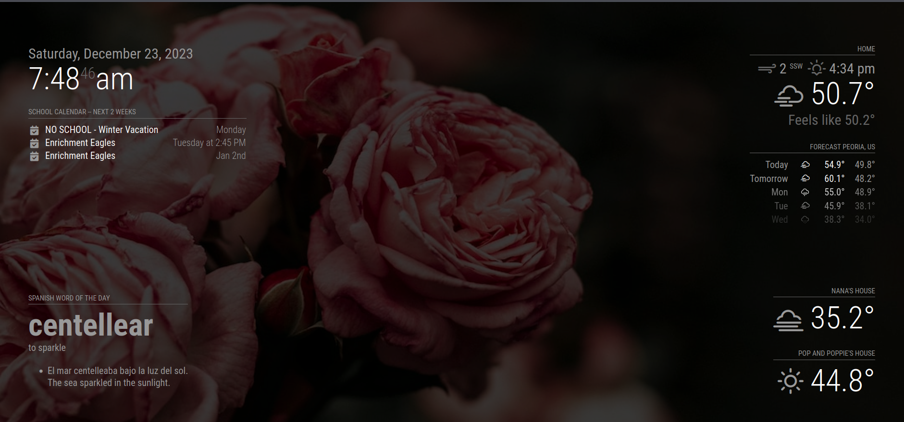
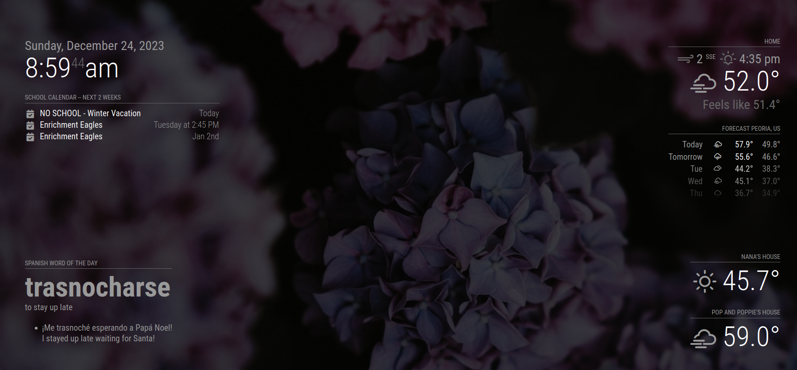

# MagicMirror Configs
https://magicmirror.builders/

### Modules Ive Used
* MMM-Unsplash: https://github.com/parnic/MMM-Unsplash.git
* MMM-Pollen: https://github.com/vincep5/MMM-Pollen.git
* MMM-eswordoftheday: https://github.com/daniel-windsor/MMM-eswordoftheday.git

### Dependencies
* For NPM: NodeJS > 20: https://github.com/nodesource/distributions#debian-versions

### Screenshot

